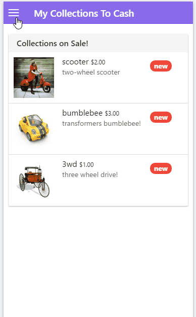

# My Collections To Cash Ionic App

 

My Collections to Cash would enable a user to have an overall view of their assets. This ionic app is a mobile version of the full browser version at http://mycollectionsapp.au-syd.mybluemix.net/.

## Features 

a) Login

b) View Collections on Sale

c) View My Collections

d) View Collection Detail

e) Add Collection Comments

## App Preview

<!-- GIF of Android app -->
 

## File Structure

myCollections-Ionic
+---hooks
|   \---after_prepare
+---node_modules
|   +---.bin
|   \---gulp
+---platforms
|   \---android
+---resources
|   +---android
|   |   +---icon
|   |   \---splash
|   +---gifs
|   \---ios
|       +---icon
|       \---splash
+---scss
\---www
    +---css
    +---img
    +---js
    +---lib
    \---templates

## Run Locally

This assumes you already have an emulator setup for iOS or Android. Substitute `ios` for `android` below to use Android.

    npm install -g ionic cordova

    git clone https://github.com/jsferrer1/myCollections-Ionic.git

    cd myCollections-Ionic

    ionic platform add ios

    ionic emulate ios

    or Android

    ionic run android

    or run in browser

    ionic serve --lab

## LICENSE

Ionic is licensed under the MIT Open Source license. For more information, see the LICENSE file in this repository.
